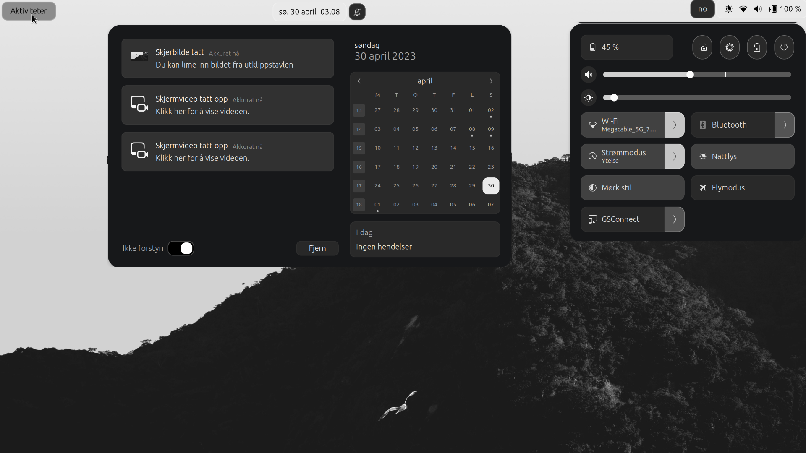

# De Mørke Norske Ramnen Shell Theme

This theme is inspired by u/Adventurous_Body2019 bar, and the songs made by wardruna and the early norwegian beliefs about the albine animals whom they belived had the answers and were wisdom bringers.

So if you enjoy the good all consistent dark themes Then this theme is for you,

### !TODO
- add cartoonish theme
- pulish animations
- publish reddit work flow and cartoonish theme

## Instructions

You only need to clone the repo or download the zip file with the code, extract it and copy the folders inside Gnome-Shell-Theme to either `~/.themes` or `~/.local/share/themes`
after that install the [user themes extension](https://extensions.gnome.org/extension/19/user-themes/) and `gnome-tweaks`, from there you can select the shell theme.

finally the wallpaper is in the repo root folder undr Wallpaper
### If you want the folder an app icons

i use the yaru-sage-dark theme-for-legacy-apps and icon-set which you can find pretty easly in the internet, if not install app-themes to `~/.themes` or `~/-local/share/themes`
and the icons-yaru-sage-dark to `~/.icons` or `~/.local/share/icons/`

then from `gnome-tweaks`
in aparence change icon theme to yaru-sage-dark
and legacy apps theme to yaru-sage-dark

Enjoy!!

if you have a better match for this theme icon set plis comment on the reddit post or in github issues 

## ScreenShots

